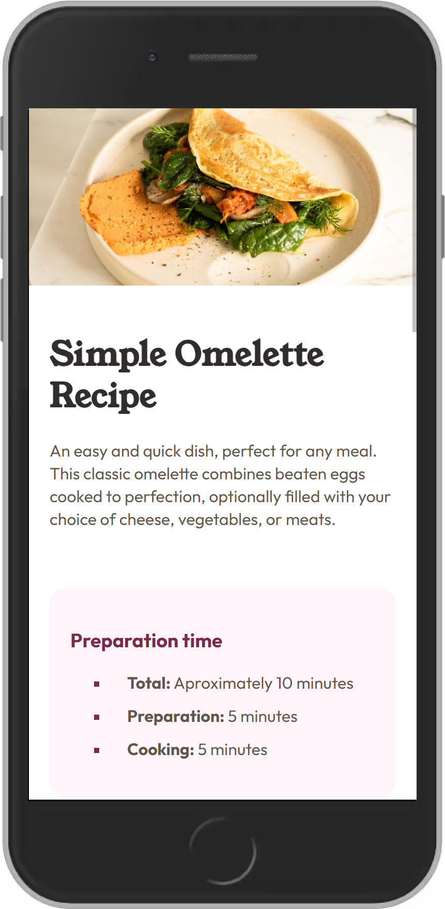
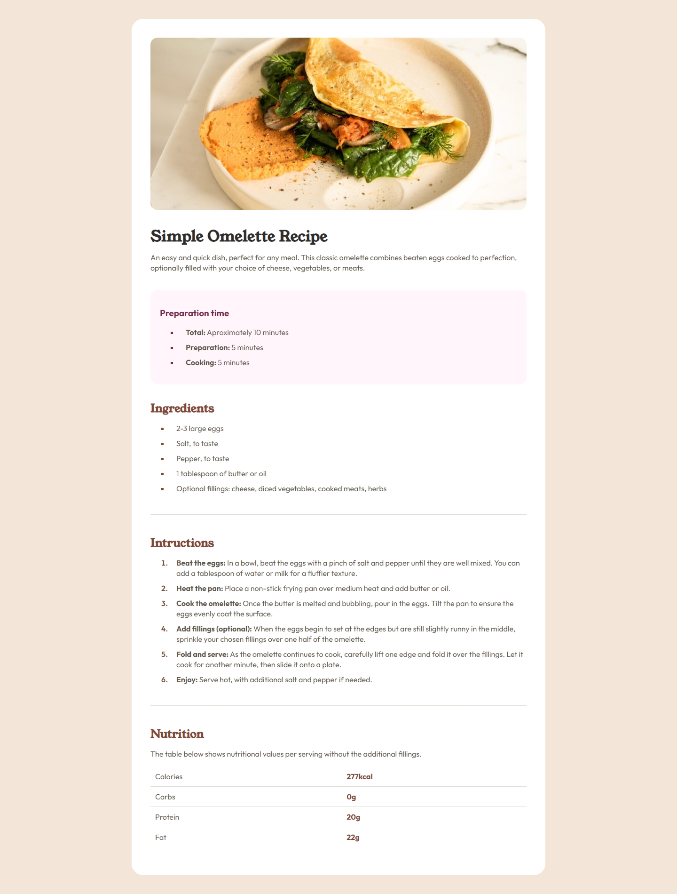

# Recipe Page - Solution


Solución del proyecto **Recipe Page** como parte del reto #100DaysOfProjects. La mejor manera de escribir buen código es programando todos los días.⚡

El diseño de este reto es propiedad original de [Frontend Mentor](https://www.frontendmentor.io/challenges).

## Tabla de contenidos

- [Vision general](#vision-general)
  - [El desafio](#el-desafio)
  - [Capturas de pantalla](#capturas-de-pantalla)
  - [Enlaces](#enlaces)
- [Proceso de trabajo](#proceso-de-trabajo)
  - [Desarrollo](#desarrollo)
  - [Lo que aprendimos](#lo-que-aprendimos)
  - [Lo que aprenderemos](#lo-que-aprenderemos)
  - [Recursos](#recursos)
- [Autor](#autor)
- [Agradecimientos](#agradecimientos)

## Vision general

### El desafio

Se requiere desarrollar una página de recetas y lograr que se parezca lo más posible al diseño.

Para realizar este desafío, necesitaremos conocimientos básicos de HTML y CSS.

Los usuarios deberían poder:

- Ver el diseño óptimo según el tamaño de pantalla del dispositivo.

### Capturas de pantalla

Diseño adaptado a cualquier tipo de pantalla:




### Enlaces

El proyecto se encuentra alojado en un hosting gratuito(Netlify):

- [Pagina web](https://fc-recipe-page.netlify.app/)
- [Codigo fuente](https://github.com/frontend-club/18-day-recipe-page)
- [Codepen](https://codepen.io/frontend-club/pen/MWxOwRY)

## Proceso de trabajo

### Desarrollo

Para realizar el proyecto se empleó:

- Marcado HTML
- Propiedades CSS
- Media queries

### Lo que aprendimos

Nuevamente procuramos usar la [metodologia BEM](https://getbem.com/introduction/) para el marcado HTML.

```html
<main class="container">
  <div class="recipe">
    <section class="recipe__header"></section>
    <section class="recipe__copy"></section>
    <section class="recipe__preparation"></section>
    <section class="recipe__ingredients"></section>
    <hr />
    <section class="recipe__instructions"></section>
    <hr />
    <section class="recipe__nutrition"></section>
  </div>
</main>
```

`Media Query` para adaptar el diseño a pantallas pequeñas:

```css
@media screen and (min-width: 375px) and (max-width: 767px) {
}
```

### Lo que aprenderemos

Más sobre el concepto _mobile-first_ y las propiedades `position` de CSS.

### Recursos

Hemos recopilado una lista de recursos que puede ayudarte:

- [UI Design Daily](https://www.uidesigndaily.com/) - diseños UI de excelente calidad para codificar.
- [Google Fonts](https://fonts.google.com/) - fuentes que podemos descargar y usar para nuestros proyectos.
- [BEM Methodology In CSS: A Quick Start Guide](https://scalablecss.com/bem-quickstart-guide/) - una guía corta pero precisa para comprender la metología BEM.

## Autor

Nuestro canales sociales para saber más sobre los contenidos e ideas que compartimos en la comunidad:

- [Blog](https://frontend-club.bullet.site/)
- [Twitch](https://www.twitch.tv/frontendclub)
- [Tik Tok](https://www.tiktok.com/@frontendclub)
- [LinkedIn](https://www.linkedin.com/in/frontendclub/)
- [Codepen](https://codepen.io/frontend-club)
- [Facebook](https://www.facebook.com/frontendclubfb)
- [Instagram](https://www.instagram.com/frontendclubig/)
- [Grupo de Facebook](https://www.facebook.com/groups/100daysofprojects)

## Agradecimientos

Agradecemos a los miembros de la comunidad **Frontend Club**, que nos inspiran a seguir creando contenido y compartiendo iniciativas para mejorar nuestras habilidades en HTML, CSS, JavaScript y Git.

> “Yo puedo hacer cosas que tú no puedes, tú puedes hacer cosas que yo no puedo; juntos podemos hacer grandes cosas”. — Madre Teresa de Calcuta.
